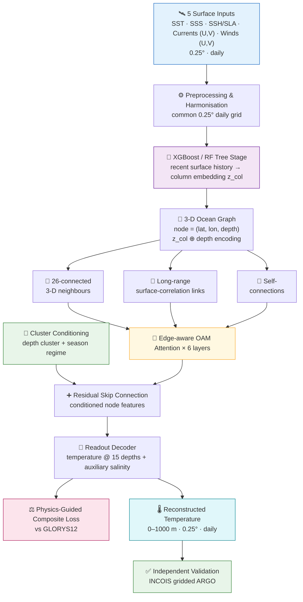
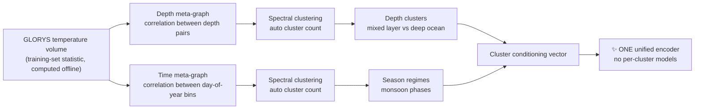

<div align="center">

# 🌊 OceanEmbed

### Seeing Beneath the Surface — Reconstructing Subsurface Ocean Temperature from Satellite Observations

**Smart India Hackathon 2026 · Problem Statement SIH26066 · Team Crisis Workers**

[](#)
[](#)
[](#)
[](#)

[](#)
[](#)
[](#)
[](#)
[](#)
[](#)
[](https://oceanembed-4z4g.onrender.com/)

<br/>

### 🔗 [**Live Prototype**](https://oceanembed-4z4g.onrender.com/) &nbsp;•&nbsp; 🎬 [**Demo Video**](https://www.youtube.com/watch?v=DaPUYD2coU8) &nbsp;•&nbsp; 📂 [**Dataset**](https://drive.google.com/drive/folders/1DK8M_-ag9nDpAFU06-tXmQKexKEJ3FSv)

<br/>

| 🎯 Overall RMSE | 📈 Overall Correlation | ⚖️ Overall Bias | 🪶 Model Size |
|:---:|:---:|:---:|:---:|
| **0.9736 °C** | **0.9903** | **−0.042 °C** | **~0.1M params · ~1.5 MB** |

<sub>Validated on independent ARGO observations the model never trained on · 0–1000 m · North Indian Ocean</sub>

</div>

---

## 📑 Table of Contents

- [The Problem](#-the-problem)
- [Our Solution](#-our-solution)
- [Architecture](#%EF%B8%8F-architecture)
- [Physics-Guided Loss](#-physics-guided-composite-loss)
- [Spatio-Temporal Clustering](#-spatio-temporal-clustering)
- [Results](#-results)
- [Why GNN?](#-why-gnn-three-architectures-one-verdict)
- [The Prototype](#%EF%B8%8F-the-prototype)
- [Impact](#-impact--benefits)
- [Data Sources](#%EF%B8%8F-data-sources)
- [Tech Stack](#-tech-stack)
- [Project Structure](#-project-structure)
- [Try It Live](#-try-it-live)
- [References](#-research-references)
- [Team](#-team)

---

## 🌐 The Problem

Satellites give us a sharp, **daily** picture of the ocean **surface** — temperature, salinity, sea level, currents and winds. What they cannot see is what lies **beneath**, and that hidden layer is what drives cyclone intensification, marine heatwaves and ocean–monsoon coupling.

| ❗ Problem | 👥 Who Feels It | 👀 What It Looks Like |
|---|---|---|
| **No real depth data** | Coast guard, disaster teams | Big empty gaps on the map where ARGO floats never pass |
| **Forecasts arrive too late** | Coastal communities, agencies | Weeks-old profiles used for today's decisions |
| **No interactive dashboard** | Local officials, coastal residents | Raw NetCDF files and portals built only for oceanographers |
| **Surface hides the subsurface** | Everyone relying on SST alone | A calm-looking surface hiding a heatwave or cold front below |

> 🛰️ **~4,000 ARGO floats** worldwide, each reporting roughly **once every 10 days** — large parts of the Arabian Sea and Bay of Bengal go weeks without a fresh profile. Moored buoys (OMNI / RAMA) are accurate but exist only at a handful of fixed points.

---

## 💡 Our Solution

**OceanEmbed reconstructs the full 3-D ocean temperature — every day, every 0.25° grid cell, 15 depths down to 1000 m — using _only_ surface satellite data.**

<table>
<tr>
<td width="25%" align="center">🛰️<br/><b>Daily Satellite Intake</b><br/><sub>5 surface variables, available every day with zero waiting time</sub></td>
<td width="25%" align="center">🧩<br/><b>Seamless Data Fusion</b><br/><sub>Multi-mission feeds harmonised onto one clean 0.25° daily grid</sub></td>
<td width="25%" align="center">🧠<br/><b>Pattern Learning Engine</b><br/><sub>Learns how surface "signatures" map to the structure below</sub></td>
<td width="25%" align="center">✅<br/><b>Depth Reconstruction & Trust Check</b><br/><sub>Physically consistent profiles, checked against real ARGO data</sub></td>
</tr>
</table>

**Coverage:** North Indian Ocean · 5°N–30°N · 45°E–105°E
**Output depths (m):** `0 · 5 · 10 · 20 · 30 · 50 · 75 · 100 · 125 · 150 · 200 · 300 · 500 · 700 · 1000`

---

## 🏗️ Architecture



<details>
<summary><b>📋 Step-by-step pipeline</b></summary>
<br/>

1. **Harmonise** 5 surface inputs (SST · SSS · SSH/SLA · Currents · Winds) to a common **0.25°, daily** grid. No subsurface data is ever used as input.
2. **XGBoost module** summarises each location's recent surface history (window statistics: mean, std, trend, lag) into a compact temporal embedding `z_col`.
3. **Build the 3-D graph** — every `(latitude, longitude, depth)` cell becomes a node combining `z_col` with a learned depth encoding.
4. **Combine three adjacency sources** — 26-connected spatial neighbours, long-range surface-correlation links, and self-connections.
5. **Edge-aware OAM attention** refines node representations using both node and edge features across stacked layers.
6. **Cluster-conditioning skip connection** preserves each node's depth and seasonal regime after the attention stack.
7. **Readout decoder** reconstructs temperature at each depth and predicts auxiliary salinity for the physics-guided loss.
8. **Train on GLORYS12** and **validate independently** on gridded ARGO observations.

</details>

---

## ⚖️ Physics-Guided Composite Loss

Pure data-fitting models can "hallucinate" plausible-looking but physically impossible profiles. OceanEmbed adds three ocean-physics penalties on top of the data term:

$$
\mathcal{L}_{total} = \mathcal{L}_{data} + \lambda_1 \mathcal{L}_{stability} + \lambda_2 \mathcal{L}_{heat} + \lambda_3 \mathcal{L}_{boundary}
$$

| Term | What it enforces | How |
|---|---|---|
| 🎯 **L<sub>data</sub>** | Match the reanalysis | Weighted MAE vs GLORYS12 |
| 🧱 **L<sub>stability</sub>** | No density inversions | `ReLU(−∂ρ/∂z)` using predicted T + auxiliary salinity |
| 🔥 **L<sub>heat</sub>** | Heat advection–diffusion | PDE residual computed with autograd |
| 🌅 **L<sub>boundary</sub>** | Surface consistency | T(z = 0) vs satellite SST |

> 🔥 **Warm start:** λ₁ = λ₂ = 0 at first — the model trains on L<sub>data</sub> alone, then the physics weights ramp up once the baseline converges.

---

## 🧭 Spatio-Temporal Clustering

The ocean behaves very differently in the mixed layer, the thermocline and the deep ocean — and across monsoon phases. Instead of imposing fixed depth bands or a monsoon calendar, **we let the data reveal how the ocean changes**:



---

## 📊 Results

### Overall (validated on independent ARGO)

<div align="center">

| Metric | Value |
|:---:|:---:|
| **RMSE** | `0.9736 °C` |
| **Correlation** | `0.9903` |
| **Bias** | `−0.042 °C` |

</div>

### Depth-wise evaluation

| Depth (m) | RMSE (°C) | Correlation | Bias (°C) | |
|:---:|:---:|:---:|:---:|:---:|
| 0 | 0.5090 | 0.9465 | 0.1183 | 🟢 |
| 5 | 0.5196 | 0.9443 | 0.1424 | 🟢 |
| 10 | 0.5155 | 0.9428 | 0.2350 | 🟢 |
| 20 | 0.5255 | 0.9208 | −0.0036 | 🟢 |
| 30 | 0.6866 | 0.8835 | 0.2574 | 🟢 |
| 50 | 1.0429 | 0.7924 | −0.0105 | 🟡 |
| 75 | 1.5719 | 0.7631 | −0.1567 | 🔴 |
| 100 | 1.5930 | 0.7084 | −0.2438 | 🔴 |
| 125 | 1.5250 | 0.6359 | −0.3390 | 🔴 |
| 150 | 1.3870 | 0.7032 | −0.4474 | 🔴 |
| 200 | 1.1421 | 0.7555 | −0.1973 | 🟡 |
| 300 | 0.8686 | 0.8130 | −0.0593 | 🟢 |
| 500 | 0.6765 | 0.8363 | −0.1435 | 🟢 |
| 700 | 0.6309 | 0.8499 | −0.0709 | 🟢 |
| 1000 | 0.6399 | 0.7797 | 0.1253 | 🟢 |

> 🔍 **Inference:** Error peaks right around the **thermocline (75–150 m)**, where temperature changes steeply and nonlinearly. At all other depths the model stays close to **~0.5 °C RMSE**.

---

## 🥇 Why GNN? Three Architectures, One Verdict

We benchmarked three architectures on the same task before choosing our final model:

| Architecture | Result | Verdict |
|---|---|---|
| 🔷 **ViT** | ~2 °C RMSE, inflated in the thermocline | ❌ Struggled |
| 🔶 **3D U-Net++** | ~0.97 °C RMSE, but a −0.26 °C bias | ⚠️ Competitive but biased |
| 🟢 **GNN-OAM** *(ours)* | Near-zero bias (−0.04 °C), upper-ocean error roughly halved (0.51 °C vs 0.96 °C at the surface) | ✅ **Selected** |

The graph structure models ocean connectivity **explicitly** — a surface eddy is literally connected to the temperature layers beneath it — which makes predictions physically interpretable. This follows Ou et al. (2024), whose GNN with optimised attention captured long-range ocean connections better than CNNs or ViTs.

---

## 🖥️ The Prototype

### 🔗 **[oceanembed-4z4g.onrender.com](https://oceanembed-4z4g.onrender.com/)**

An interactive web dashboard that turns raw model output into something anyone can read — no NetCDF expertise required.

| Feature | Description |
|---|---|
| 🗺️ **Interactive Basin Map** | Full North Indian Ocean at 0.25° resolution with smooth colour-mapped temperature fields |
| 📏 **Depth Rail** | Slide through all 15 standard depths from 0 m to 1000 m |
| ⏯️ **Timeline Playback** | Day-by-day slider with play / pause animation |
| 📍 **Point Diagnostics** | Click any ocean point for its temperature time series and full vertical profile, with warm-layer and mixed-layer depth marked |
| 🌡️ **Derived Layers** | Switch to warm-layer depth (D20), mixed-layer depth, and horizontal temperature fronts at 0, 50 and 100 m |
| 🔵 **ARGO Overlay** | Show real ARGO float positions on top of the reconstructed field |
| 📈 **Basin Average** | Basin-wide mean temperature over time |
| 🌍 **Multiple Basemaps** | Satellite, NASA Blue Marble, ocean bathymetry and more |
| 💾 **NetCDF Export** | Download any day as a CF-compliant NetCDF — raw temperature or the full derived-layer set (incl. cyclone heat potential) |

> ⚙️ Every derived quantity is computed **server-side** from the raw temperature field, so the map, charts and exports always stay consistent.

---

## 🌟 Impact & Benefits

<table>
<tr>
<td width="50%" valign="top">

### 🌀 Disaster Management
INCOIS's SAMUDRA issues storm-surge and high-wave alerts, but has **no subsurface heat-content layer** for cyclone intensity. OceanEmbed computes basin-wide daily **TCHP** (Tropical Cyclone Heat Potential) and the **26 °C isotherm depth (D26)** — flagging pre-conditioning zones for **rapid intensification**, especially in the high-TCHP Bay of Bengal.

</td>
<td width="50%" valign="top">

### 🔥 Marine Heatwaves
Current monitoring relies on surface-only SST and misses heat building up below. Applying **Hobday-style 90th-percentile thresholds** across reconstructed depth profiles gives earlier, **depth-resolved** heat-stress alerts for coral reefs and marine ecosystems.

</td>
</tr>
<tr>
<td width="50%" valign="top">

### 🛰️ INCOIS & Forecasting Agencies
A continuous, **gap-free** subsurface product that complements sparse ARGO coverage for day-to-day ocean-state forecasting and advisories.

</td>
<td width="50%" valign="top">

### 🔬 Climate & Research
Basin-wide daily subsurface temperature enables monsoon, heatwave and coral-bleaching studies **without waiting on sparse float coverage**.

</td>
</tr>
</table>

### ✅ Feasibility at a Glance

| | |
|---|---|
| 🧪 **Technical** | Surface inputs only · 3-D graph links surface eddies to the layers beneath · tested on unseen ARGO data |
| 💰 **Economic** | No new satellites, sensors or ship cruises — every input is an open product already produced daily · ~0.1M parameters, ~1.5 MB pipeline |
| 🏭 **Operational** | Derived layers (TCHP, D26, heatwave flags) come straight from the profiles · retrained periodically on fresh ARGO + reanalysis so drift shows up early |

---

## 🛰️ Data Sources

| Variable | Dataset |
|---|---|
| 🌡️ **SST** | GHRSST Level 4 MUR 0.25° Global Foundation SST Analysis (v4.2) |
| 🧂 **SSS** | SMAP L3 (NASA) |
| 🌊 **SSH / SLA** | DUACS altimetry |
| ➡️ **Surface Currents (U, V)** | OSCAR v2.0 Final |
| 💨 **Surface Winds (U, V)** | ASCAT scatterometer / ERA5 10 m winds |
| 🎯 **Training Target** | GLORYS12V1 reanalysis (Copernicus Marine) |
| ✅ **Independent Validation** | INCOIS Live Access Server — gridded ARGO |

> 🔒 **Multi-layer validation:** reconstructions are stress-tested against INCOIS gridded ARGO fields, real-time OMNI / RAMA buoy profiles, and the operational isQG baseline.

---

## 🧰 Tech Stack

| Layer | Technologies |
|---|---|
| 🧠 **Model** | PyTorch (GNN-OAM graph attention network) · scikit-learn / XGBoost tree stage · TEOS-10 |
| ⚙️ **Backend** | FastAPI · xarray · netCDF4 · NumPy · Matplotlib |
| 🎨 **Frontend** | React · TypeScript · Vite · Tailwind CSS · Leaflet · Recharts |
| ☁️ **Deployment** | Render (API + built frontend served together) |
| 📓 **Training** | Kaggle notebooks |

---

## 📁 Project Structure

```
Sihhh/
├── 🧠 model/              Kaggle training notebook + trained GNN-OAM weights
│   ├── gnn-oam-6-layer-FINAL.ipynb
│   ├── Model-Weights.zip
│   └── Model-Training-and-Tuning.zip
├── ⚙️ backend/            FastAPI server
│   ├── providers/         mock / file-based / live-model data sources behind one interface
│   ├── derived.py         warm-layer depth, MLD, fronts, TCHP …
│   ├── netcdf_writer.py   CF-compliant NetCDF export
│   ├── data/              daily model output + ARGO float positions
│   └── main.py            entry point
├── 🎨 frontend/           React + TypeScript dashboard
│   └── src/components/    MapView, DepthSlider, TimeSlider, ProfileChart …
├── 📦 kaggle/             export model output from Kaggle into the dashboard
├── 🛠️ scripts/            setup, validation and test utilities
├── 🔧 config/             tunable configuration
└── 🚀 render.yaml         Render deployment blueprint
```

---

## 🌍 Try It Live

<div align="center">

OceanEmbed is fully deployed — no setup needed. Just open the dashboard in your browser:

### 👉 [**oceanembed-4z4g.onrender.com**](https://oceanembed-4z4g.onrender.com/) 👈

<sub>⏳ Hosted on Render's free tier — the first load may take a few seconds while the server wakes up.</sub>

</div>

---

## 📚 Research References

1. **Feng et al. (2026)** — DSVIT, *Deep-Sea Research Part II*. [10.1016/j.dsr2.2025.105589](https://doi.org/10.1016/j.dsr2.2025.105589)
2. **Adaptive Spatiotemporal Clustering Framework for 3D OST Reconstruction** — arXiv 2605.00860 (2026), includes an Indian Ocean test region
3. **North Atlantic Explainable DL Framework** — *Int'l J. Digital Earth* (2026). [10.1080/17538947.2026.2632430](https://doi.org/10.1080/17538947.2026.2632430)
4. **isQG method** — Wang et al. (2013), *J. Phys. Oceanogr.*; Liu et al. (2017), *JGR Oceans*
5. **Attention-enhanced 3D-U-Net++ with Transfer Learning** — *ESSD* (2026), Northwest Pacific
6. **Ou et al. (2024)** — 3-D Ocean Temperature Prediction via Graph Neural Network with Optimized Attention Mechanisms, *IEEE Geoscience*

---

## 👥 Team

<div align="center">

### 🚨 Team Crisis Workers

**Smart India Hackathon 2026** · Problem Statement **SIH26066**
Ministry of Earth Sciences (MoES) · Theme: Disaster Management · Category: Software

<br/>

[](https://oceanembed-4z4g.onrender.com/)
[](https://www.youtube.com/watch?v=DaPUYD2coU8)
[](https://drive.google.com/drive/folders/1DK8M_-ag9nDpAFU06-tXmQKexKEJ3FSv)

<br/>

<sub>Made with 🌊 and ☕ for the North Indian Ocean</sub>

</div>
